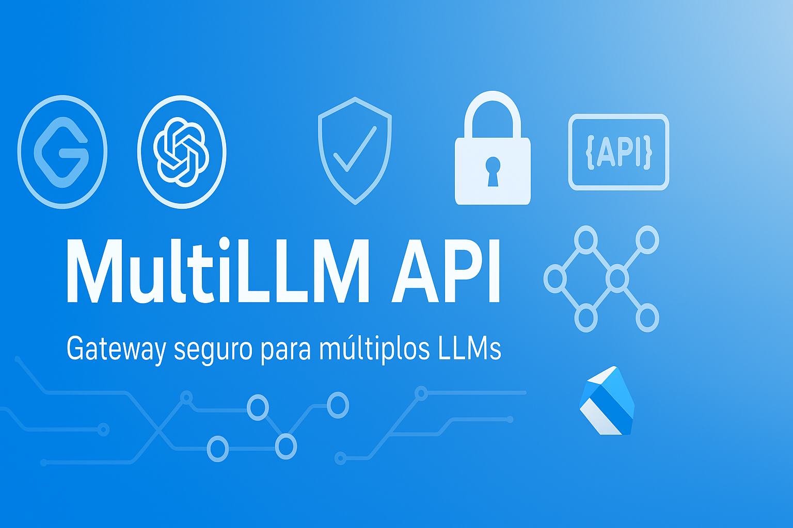

# 🚀 MultiLLM API

[](https://opensource.org/licenses/MIT)
[](https://github.com/cristianoaredes/multi-llm-api)
[](https://dart.dev)
[](https://www.docker.com/)

Uma API backend robusta e escalável construída com Dart e o framework Shelf, projetada para servir como um gateway unificado para múltiplos modelos de linguagem (LLMs). Este projeto integra nativamente APIs como Google Gemini e OpenRouter, permitindo acesso padronizado a diversos modelos como GPT, Claude, Llama, etc.



> **⚠️ AVISO: Este projeto está em desenvolvimento ativo (WIP)**  
> Funcionalidades podem mudar e a API ainda não é considerada estável para uso em produção.

## ✨ Recursos

- **Arquitetura feature-first** para código modular e organizado
- **Gateway unificado para múltiplos LLMs**:
  - Google Gemini API
  - OpenRouter (acesso a OpenAI GPT, Anthropic Claude, Meta Llama, etc.)
  - Interface padronizada para múltiplos provedores
- **Streaming de respostas** em tempo real
- **Sistema de fallback** entre provedores
- **Autenticação completa com JWT**
- **Sistema de validação e sanitização** de entrada para proteger contra injeções
- **PostgreSQL** para armazenamento de dados
- **Cache** para otimização de performance
- **Documentação OpenAPI/Swagger** integrada
- **Configuração por ambiente** (desenvolvimento, produção, teste)
- **Contêinerização** com Docker e Docker Compose
- **Testes abrangentes** unitários e de integração

## 🏗️ Arquitetura

A aplicação segue o padrão feature-first, promovendo separação de preocupações e modularidade:

```
multi-llm-api/
├── bin/              # Ponto de entrada da aplicação
├── lib/
│   ├── core/         # Componentes centrais (config, DI, middleware, etc.)
│   │   ├── config/   # Configurações da aplicação
│   │   ├── di/       # Injeção de dependência
│   │   ├── error/    # Tratamento de erros
│   │   ├── logging/  # Configuração de logs
│   │   ├── middleware/ # Middlewares da aplicação
│   │   ├── server/   # Configuração do servidor
│   │   └── utils/    # Utilitários
│   ├── features/     # Módulos de funcionalidades
│   │   ├── auth/     # Autenticação e autorização
│   │   │   ├── data/     # Camada de dados
│   │   │   ├── domain/   # Camada de domínio
│   │   │   └── presentation/ # Camada de apresentação
│   │   └── generative/ # IA Generativa
│   │       ├── domain/   # Camada de domínio
│   │       └── presentation/ # Camada de apresentação
│   └── generated_api/ # Código gerado
├── openapi/          # Documentação da API
├── test/             # Testes
└── ...               # Outros arquivos de configuração
```

## 🚀 Início Rápido

### Usando Docker (Recomendado)

1. **Clone o repositório**

```bash
git clone https://github.com/cristianoaredes/multi-llm-api.git
cd multi-llm-api
```

2. **Configure o ambiente**

```bash
cp .env.example .env.development
# Edite .env.development com suas chaves de API e configurações
```

3. **Execute com Docker Compose**

```bash
docker-compose up -d
```

4. **Acesse os serviços**

- **API**: http://localhost:8081
- **Documentação (Swagger)**: http://localhost:8083
- **Gerenciador de DB (Adminer)**: http://localhost:8082

### Localmente

1. **Pré-requisitos**: Dart SDK 3.0+, PostgreSQL (opcional), Redis (opcional)

2. **Instale dependências**

```bash
dart pub get
```

3. **Configure o ambiente**

```bash
cp .env.example .env
# Edite .env com suas configurações
```

4. **Execute a aplicação**

```bash
dart run bin/server.dart
```

## 📋 Endpoints da API

### Autenticação

- `POST /api/v1/auth/register` - Registre um novo usuário
- `POST /api/v1/auth/login` - Autentique e receba um token JWT
- `POST /api/v1/auth/refresh` - Atualize um token JWT
- `POST /api/v1/auth/logout` - Invalide um token

### IA Generativa

- `GET /api/v1/generate/models` - Liste os modelos disponíveis
- `POST /api/v1/generate/text` - Gere texto a partir de um prompt
- `POST /api/v1/generate/text/stream` - Stream de texto gerado em tempo real
- `POST /api/v1/generate/chat` - Continue uma conversa com IA
- `POST /api/v1/generate/chat/stream` - Stream de respostas de chat em tempo real
- `GET /api/v1/generate/info` - Informações sobre o modelo atual
- `POST /api/v1/generate/cache/clear` - Limpe o cache de respostas

## 🔧 Configuração

A aplicação usa arquivos `.env` para diferentes ambientes. Variáveis importantes incluem:

```env
# Servidor
SERVER_PORT=8080
LOG_LEVEL=INFO
ENVIRONMENT=development

# JWT
JWT_SECRET="sua_chave_secreta"
JWT_EXPIRATION_HOURS=24

# AI Provider (gemini ou openrouter)
AI_PROVIDER=gemini

# Gemini API
GEMINI_API_KEY="sua_chave_api_gemini"
GEMINI_MODEL="gemini-1.5-flash-latest"
GEMINI_MAX_TOKENS=2048
GEMINI_TEMPERATURE=0.7
GEMINI_SAFETY_HARASSMENT=BLOCK_MEDIUM_AND_ABOVE
GEMINI_SAFETY_HATE_SPEECH=BLOCK_MEDIUM_AND_ABOVE
GEMINI_SAFETY_SEXUALLY_EXPLICIT=BLOCK_MEDIUM_AND_ABOVE
GEMINI_SAFETY_DANGEROUS=BLOCK_MEDIUM_AND_ABOVE
GEMINI_ENABLE_STREAMING=true

# OpenRouter API
OPENROUTER_API_KEY="sua_chave_api_openrouter"
OPENROUTER_BASE_URL="https://openrouter.ai/api/v1"
OPENROUTER_MODEL="openai/gpt-3.5-turbo"
OPENROUTER_MAX_TOKENS=2048
OPENROUTER_TEMPERATURE=0.7
OPENROUTER_ENABLE_STREAMING=true

# Database
DB_HOST=localhost
DB_PORT=5432
DB_NAME=multi_llm_api
DB_USERNAME=postgres
DB_PASSWORD=postgres
```

## 🧪 Testes

Execute os testes com:

```bash
dart test
```

Para ver a cobertura de testes:

```bash
dart run scripts/run_tests_with_coverage.sh
```

## 📚 Exemplos de Uso

### Gerando Texto

```bash
curl -X POST http://localhost:8081/api/v1/generate/text \
  -H "Content-Type: application/json" \
  -H "Authorization: Bearer seu_token_jwt" \
  -d '{"prompt": "Explique como fazer uma API em Dart", "model_id": "gemini-1.5-flash"}'
```

### Streaming de Chat

```javascript
// JavaScript (front-end)
const eventSource = new EventSource('http://localhost:8081/api/v1/generate/chat/stream');
eventSource.onmessage = (event) => {
  const data = JSON.parse(event.data);
  if (data.chunk) {
    // Processar cada chunk de texto recebido
    console.log(data.chunk);
  }
};
```

## 🛠️ Tecnologias

- **Dart** e framework **Shelf**
- **PostgreSQL** para persistência
- **JWT** para autenticação
- **Google Gemini API** para IA generativa
- **OpenRouter** para acesso a múltiplos LLMs
- **OpenAPI/Swagger** para documentação
- **Docker** para containerização

## 🔄 Roteiro de Desenvolvimento

- [x] Integração com Google Gemini
- [x] Integração com OpenRouter
- [x] Autenticação JWT
- [x] Middleware de sanitização
- [x] Streaming de respostas
- [x] Configurações de segurança
- [x] Completar a renomeação do pacote de 'api_dart' para 'multi_llm_api' em todos os arquivos
- [ ] Implementar sistema de fallback entre modelos
- [ ] Suporte a prompts multimodais (imagens, áudio)
- [ ] Implementar cache distribuído
- [ ] Melhorar a documentação da API

## 🤝 Contribuindo

Contribuições são bem-vindas! Por favor, siga estes passos:

1. Verifique os issues abertos ou abra um novo descrevendo sua contribuição
2. Faça um fork do repositório
3. Crie uma nova branch (`git checkout -b feature/nova-funcionalidade`)
4. Faça commit das suas mudanças (`git commit -m 'feat: adiciona nova funcionalidade'`)
5. Envie para a branch (`git push origin feature/nova-funcionalidade`)
6. Abra um Pull Request

Este projeto segue o fluxo de trabalho GitFlow e usa o padrão de commits convencionais.

## 📄 Licença

Este projeto está licenciado sob a Licença MIT - veja o arquivo [LICENSE](LICENSE) para detalhes.

## 🙏 Agradecimentos

- A comunidade Dart por fornecer excelentes ferramentas
- Todos os contribuidores que ajudaram a melhorar este projeto

## 🔍 Palavras-chave

`dart` `api` `llm` `generative-ai` `chatgpt` `gemini` `claude` `jwt` `rest-api` `streaming` `docker` `postgresql` `shelf` `openapi` `swagger` `security` `sanitization` `middleware` `clean-architecture` `feature-first` `dependency-injection`

## 📊 Métricas do Projeto


## 🤝 Mantenedores

| [**Cristiano Aredes**](https://github.com/cristianoaredes) |
| ---------------------------------------------------------- |
| Mobile Architect & AI Engineer - [aredes.me](https://aredes.me) |

## 📫 Contato

Para sugestões, dúvidas ou contribuições:

* 🌐 Site: [aredes.me](https://aredes.me)
* 📧 Email: cristiano@aredes.me
* 💼 LinkedIn: [Cristiano Aredes](https://www.linkedin.com/in/cristianoaredes/)

## ⭐ Mostre seu apoio

Se este projeto te ajudou de alguma forma, considere:

* ⭐ Dar uma estrela no GitHub
* 🐛 Reportar bugs ou sugerir melhorias em Issues
* 🔀 Fazer um fork e contribuir com o projeto
* 📢 Compartilhar com outros desenvolvedores

## 📝 Citação

Se você usar este projeto como referência em artigos ou estudos, por favor cite:

```bibtex
@software{multi_llm_api,
  author = {Cristiano Aredes},
  title = {MultiLLM API - Gateway para Múltiplos Modelos de Linguagem},
  year = {2024},
  publisher = {GitHub},
  url = {https://github.com/cristianoaredes/multi-llm-api}
}
```


 Feito com ❤️ por [Cristiano Aredes](https://aredes.me) 


⭐ **Gostou deste projeto? Dê uma estrela!** ⭐# multi_llm_api

